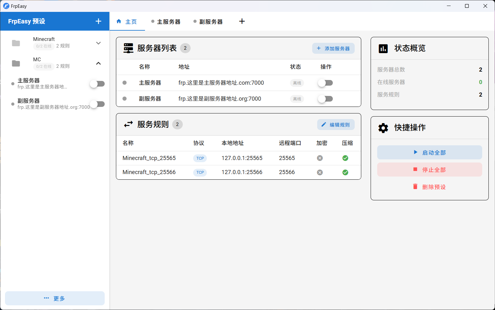

# FrpEasy

> 方便游戏联机时直接发给主机用的轻量级 frp GUI

## 简介

FrpEasy 是一个简洁易用的轻量级 frp 客户端管理工具，专为游戏联机场景设计。

**总之就是**：你配置好服务器和端口映射后，导出预设文件发给朋友，或者整个FrpEasy打包发过去，朋友一键启动即可使用，无需了解 frp 的任何技术细节也不用每一个都写一个启动.bat发过去。

## 功能特性

-  **预设分享** - 导出配置文件，或者FrpEasy预设，导入即用
-  **一键启停** - 快速开关服务器，无需命令行，记录启动关闭状态下次启动会自动链接服务器
-  **灵活配置** - 支持基础模式和 TOML 高级编辑也支持 Go 模板端口范围映射
-  **多服务器** - 可以设置同时多个服务器使用同一组服务
-  **下载更新** - 首次使用自动获取 frpc，也能手动检查frpc
-  **实时日志** - 总之就是可以看日志

## 截图



## 快速开始

### 1. 下载安装

从 Releases 页面下载最新版本，解压后运行 `FrpEasy.exe`。

### 2. 首次运行

首次启动会自动下载 frpc，等待下载完成即可开始使用。

### 3. 导入预设

- 或在软件中右键预设列表 → 导入 FrpEasy 预设
- 如果是原生frp的toml和ini也支持导入

### 4. 启动服务器

点击服务器旁边的开关按钮，或使用「全部启动」一键启动所有服务器。

## 技术栈

- **后端**: Go + Wails v2.11.0
- **前端**: Vue 3 + Vuetify 3 + TypeScript

## 本地构建

```bash
# 安装 Go 依赖
go mod download

# 安装前端依赖
cd frontend && npm install

# 开发模式（热重载）
wails dev

# 构建生产版本
wails build
```

## License

[Apache-2.0](./LICENSE)